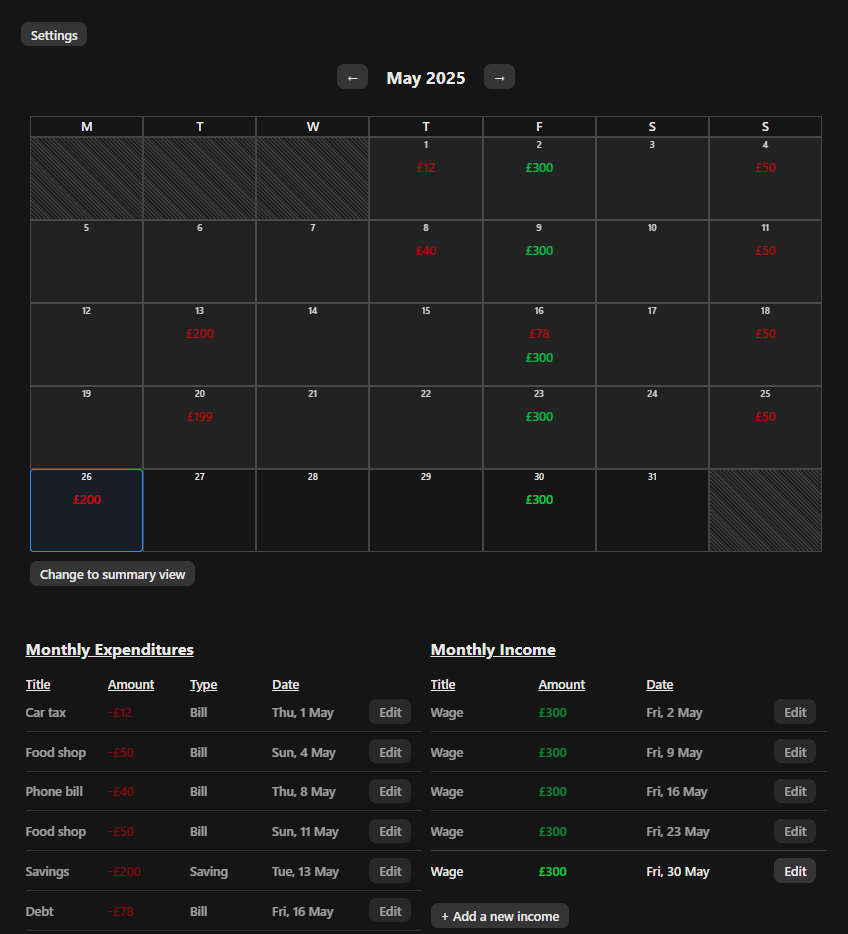
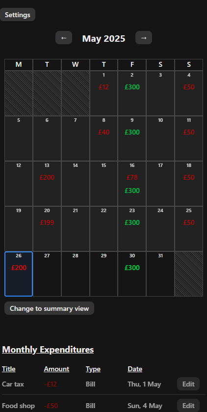
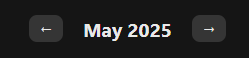

# Finance Tracker - Personal Finance Dashboard
## Project Overview
Monthly Finance Tracker is a secure, real-time, full-stack web application that empowers users to take full control of their personal finances. Designed with a strong focus on usability, performance, and data privacy, the app provides a streamlined one-page dashboard for tracking income, expenditures, and disposable income in a clear, calendar-driven format.

This project was built as both a portfolio piece and a production-grade system, emphasizing strong frontend architecture, secure backend API design, and real-world performance considerations.

Built using React (frontend), Django REST Framework (backend) and PostgreSQL, the system supports full CRUD operations on all financial entries and intelligently handles recurring transactions. It also includes features like monthly budgeting, weekly and monthly financial summaries, and dynamic currency symbol formatting — all personalized per user.





### Key Features
- One-Page Dashboard
    - Toggle between calendar, weekly, and monthly summaries with real-time financial insights.
- Dynamic Calendar View
    - Interactive financial calendar with accurate date alignment, showing income and expenditure breakdowns per day.
- Income and Expense Tracking
  - Log and manage both one-time and recurring income/expenditures, with automatic generation of future instances based on repeat frequency.
  - Create, edit, and delete financial entries with support for recurring transactions (weekly & monthly). Repeats are automatically generated with logic to avoid duplicate or outdated entries.
- Disposable Income Budgeting
  - Set and track monthly disposable income budgets. Each new month resets automatically and can be adjusted by the user.
- Data Privacy and Security
  - Each user’s data is completely isolated and protected. Every financial endpoint is protected by ownership-based permissions — ensuring users can only access their own data. No shared access is possible.
- Currency Personalization
  - Users can choose their preferred currency, which is reflected across all financial data outputs and summaries.
- JWT Authentication
  - Auth flow is powered by dj-rest-auth and SimpleJWT, ensuring secure access to all financial data. Auth state is managed in React context and persists across page reloads.
- Performance Optimized UI
  - Built with reusable React components and minimal re-renders to ensure snappy performance across devices.

### Tech Stack
| **Layer** | **Technology** | **Purpose** |
|--|--|--|
| Frontend | React, React Router, Axios | SPA interface with dynamic component rendering |
| Backend | Django, Django REST Framework | REST API with secure user-specific endpoints |
| Auth | dj-rest-auth, SimpleJWT | JWT-based login, logout, password updates |
| Database | PostgreSQL | Structured, relational financial data |
| Deployment | Heroku (API), Netlify (Frontend) | Full-stack hosting |


# Table of Contents
- [Project Overview](#project-overview)
- [UX Strategy & Goals](#the-strategy-plane)
    - [Site Goals](#site-goals)
- [Project Scope & User Stories](#project-scope--user-stories)
    - [Agile Planning](#agile-planning)
    - [Epics](#epics--user-stories)
- [Application Features & Functionality](#application-features--functionality)
    - [Features](#features)
    - [Unimplemented Features](#unimplemented-features)
    - [Future Features](#future-features)
- [The Skeleton Frame](#the-skeleton-plane)
    - [Wireframes](#wireframes)
    - [Database Design](#database-design)
    - [Security](#security)
- [The Surface Plane](#the-surface-plane)
    - [Design](#design)
    - [Colour Scheme](#color-scheme)
    - [Typography](#typography)
- [Technologies](#technologies)
    - [Technology Used](#technology-used)
    - [Python Modules Used](#python-standard-modules)
    - [External Python Modules Used](#external-python-modules)
- [Testing](#testing)
- [Bugs](#bugs)
    - [Fixed Bugs](#fixed-bugs)
    - [Unfixed Bugs](#unfixed-bugs)
- [Deployment](#deployment)
    - [Version Control](#version-control)
    - [Heroku Deployment](#heroku-deployment)
    - [Run Locally](#run-locally)
    - [Fork Project](#fork-project)
- [Credits](#credits)

# UX Strategy & Goals
> The Strategy Plane

## Site Goals
The primary site goal is to provide users with a clear, responsive, and efficient dashboard for managing their personal finances — including income, expenses, and disposable income — through an interactive, data-driven interface that simplifies financial awareness and planning.

### Functional Goals
- Allow users to securely register, log in, and log out
- Enable users to add, edit, and delete income and expenditure records
- Support repeatable transactions (weekly and monthly) that automatically generate future entries
- Provide a monthly and weekly summary view with aggregated totals
- Present a dynamic calendar view that reflects financial activity per day
- Allow users to set and track a monthly disposable income budget
- Let users track discretionary spending against their budget
- Enable users to set and store their preferred currency symbol
- Display financial data consistently and responsively across devices
- Deliver user feedback on actions (form validation, success messages, error handling)

### User-Centric Goals
- Understand where their money is going at a glance
- Track how much they’ve spent or saved in a specific time period
- Identify spending habits or recurring costs over time
- Set and stay within a self-defined spending limit (budgeting)
- Access their financial data securely from any device
- Experience a fast, mobile-friendly, intuitive interface
- Avoid repetitive data entry through smart automation (repeat logic)
- Trust that their data is private, accurate, and never shared
- Have a clear and visual representation of their finances

### Business & Technical Goals
- Build a modular, maintainable codebase following component-based design
- Ensure full CRUD functionality and secure user authentication
- Adhere to accessibility best practices and responsive design  principles
- Follow DRY, KISS, and separation-of-concerns coding practices
- Use Django REST Framework to expose a secure, structured API
- Enforce strict data permissions so users can only access their own records
- Implement environment variable-based secret handling for deployment security
- Deploy both frontend and backend to cloud platforms
- Protect all user-specific data using secure cookie-based authentication and CSRF safeguards

# Project Scope & User Stories
> The Scope Plane

## Agile Planning
This project was managed using an Agile approach with GitHub Projects to break the work into prioritized user stories and organize them into epics. 

The total time for all features to be implemented was 7 weeks, with an additional 2 weeks for refactoring, testing and documentation.
This project was split up into 4 sprints, each being just over 2 weeks.

Each card represents a feature or task, and progress was tracked using a Kanban board with the following columns:
- Backlog – New user stories and ideas
- To Do – Selected for development in the next sprint
- In Progress – Features actively being built
- Done – Completed and tested tasks

This approach allowed me to remain flexible throughout development, prioritize based on core user needs, and continuously deliver working features. All user stories were tagged with their relevant epic and updated throughout the build.

[View the GitHub Kanban Board](https://github.com/users/SemMTM/projects/3/views/1)

## Epics & User Stories
This project had 8 epics that user stories were categorised into:

### Authentication
Enable secure user login and logout using session-based cookie authentication. Required for accessing any user-specific financial data.

<details>
<summary>Click to view user stories</summary>

- As a developer, I can implement JWT Auth, so that my users are more secure and don't have to log in every time to use the app.
- As a user, I can create an account using social logins, so that creating an account is faster
- As a developer, I can verify users emails with email verification so users can secure their accounts better
- As a user, I can sign in to my account, so that I can access my finance tracker
- As a user, I can create an account, so that I can use the app and all of its features

</details>

### Budgeting
Ability to set and track monthly disposable income budgets and disposable spending. 

<details>
<summary>Click to view user stories</summary>

- As a user, I can edit my disposable income budget, so I can make changes when needed
- As a dev, the disposable income remaining resets each month
- As a user, I can see my remaining disposable income for the month, so I can easily manage my spending
- As a user, I can set a monthly disposable income budget, so that I can manage my spending
- As a user, I can see a list of all of my disposable income spending entries with details, so that I can see my spending
- As a user, I can delete a disposable income spending entry, so that I can keep my financial tracking accurate
- As a user, I can edit my disposable income spending entries, so that I can make changes if needed
- As a user, I can add my disposable income spending to the list, so that I can manage my finances.

</details>


### Documentation & Testing
Create clear README documentation, manually test all frontend and backend features, write extensive backend unit tests.

<details>
<summary>Click to view user stories</summary>

- As a developer, I will manually test all frontend and backend features, to ensure no bugs are present in the app
- As a developer, I will write a full suite of unit tests for all backend views, serializers and utility file, so that I can ensure everything functions as intended.
- As a developer, I will create the README documentation structure, I that I can ensure the app is well documented
- As a developer, I will add all content to the README, so the app is properly documented.

</details>

### Income & Expenditure Management
Allow users to add, edit, delete, and repeat income and expenditure records. Ensure permissions and repeat logic work as expected.

<details>
<summary>Click to view user stories</summary>

- As a user, I can set a category on an expenditure, so that I can categorise my spending
- As a user, I can repeat an expenditure payment, so I don't have to enter it again every month
- As a user, I can repeat an income payment, so I don't have to enter it again every month
- As a user, I can see a list of this months incomes with details, so that I can manage my income
- As a user, I can see a list of all of my expenditure entries with details, so that I can see my spending easier
- As a user, I can delete an expenditure entry, so that I can keep my financial tracking accurate
- As a user, I can edit my expenditure entries, so that I can make changes if needed
- As a user, I can edit my incomes, so that I can make changes if needed
- As a user, I can add my income to the list, so that I can manage my finances
- As a user, I can add my expenditure, so that I can manage my finances

</details>

### Setup
Initial setup of the project structure, authentication configuration, CORS, environment variables, and deployment settings.

<details>
<summary>Click to view user stories</summary>

- Purchase a domain and set up the API and Front end on the same top level domain so cookies work on mobile
- Create views to return data from API
- Create serializers for all models
- Connect the frontend to the API
- Set up database and relationships
- Set up API and connect it to the database so receive new entries

</details>

### Summary Views
Calendar, weekly, and monthly summaries showing financial activity at a glance.

<details>
<summary>Click to view user stories</summary>

- As a user, the month on the calendar view changes automatically, so that I don't have to manually change it each month
- As a user, I can easily see which day we are on as it is highlighted
- As a user, I can see a calendar view with all of my monthly finances plotted on it by day, so that I can visually see my finances
- As a user, I can switch between weekly and monthly summaries, so that I can see more detailed breakdowns of my finances
- As a user, I can see a weekly breakdown of all finances for the month, so that I can manage my weekly spending
- As a user, I can see a monthly financial summary view of that months finances, so that I can easily manage my finances

</details>

### User Settings
Enable users to update their username, email, password, and preferred currency, with all changes reflected throughout the app.

<details>
<summary>Click to view user stories</summary>

- As a user, I can reset my password via email if i forget it, so I do not lose access to my account
- As a user I can toggle dark or light mode so that I can customise the appearance of my financial tracker
- As a user I can set/change the currency on my tracker
- As a user, I can change/add an email on my account, so that I can secure my account
- As a user, I can change my username, so I can edit my account log in info
- As a user, I can change my account password
- As a user, I can access a settings page, so I can change details about my account

</details>


[Back to Table of Contents](#table-of-contents)

# Application Features & Functionality
> The Structure Plane

## Features
### Feature: Calendar Grid View
### Overview
The Calendar Grid View provides users with a clear, visual layout of their financial activity across the selected month. It aligns each day to its correct weekday and displays total income and expenditure per day, helping users spot trends, plan ahead, and track spending at a glance.


### Technical Breakdown
**Frontend Implementation**
- The `CalendarView` component generates a 5 or 6-row calendar layout using the `generateCalendarGrid()` utility. The utility calculates the correct start day of the month and fills in the grid to ensure five full rows are always rendered (35 cells).
- This function accounts for:
    - The weekday index of the first day of the selected month
    - The number of days in the month
    - Leading and trailing blank cells to ensure proper weekday alignment
- The `CalendarView` component maps over this grid to render each day in the correct position using a responsive CSS Grid layout.
- Each day is represented as a tile with date, income, and expenditure displayed using colored badges.
- Data is fetched from the `/calendar-summary/` API via Axios and rendered dynamically when the user navigates between months using prev/next controls.
- `useCalendar()` context manages the selected date and navigation logic (previous/next month), ensuring global state sync.

**Backend Implementation**
- `CalendarSummaryView` receives year and month as query parameters and returns a dictionary of day-by-day totals for the authenticated user.
- Values are raw integers in pence, with currency symbols handled client-side for consistency and formatting flexibility.
- Permissions restrict access to the user’s own income and expenditure records.

**Data Flow & Interactivity**
- On mount or month change, the frontend sends a GET request with the selected year and month.
- The backend aggregates financial data per day and returns it to the client.
- The calendar updates reactively, and the grid always renders 5 rows regardless of month length or start weekday, preserving layout stability.

### UX & Performance Benefits
- Maintains a consistent 5-row layout regardless of month length or starting weekday, preventing layout shifts and improving predictability
- Helps users build month-to-month memory of their financial rhythm by keeping tiles aligned
- Allows users to see daily financial activity at a glance with minimal scrolling
- Responsive across devices via CSS Grid
- Optimized rendering ensures only necessary re-renders and minimal DOM updates on month change

### Feature: Month Navigation & Change Handling
### Overview
The month navigation system allows users to move backward or forward in time to view their financial data for -5 or +5 months from the current month. 

This interaction updates not only the calendar grid, but also synchronizes all financial components — including expenditure lists, income, budget, and summaries — to reflect the selected period. It acts as the global time controller for the entire application.



### Technical Breakdown
**Frontend Implementation**
- Centralized in the custom `useCalendar()` context, which exposes:
    - selectedDate — the currently viewed month/year
    - `goToPreviousMonth()` and `goToNextMonth()` — handlers to shift month state
    - `isAtStart` and `isAtEnd` — booleans to limit navigation bounds
- When navigation is triggered:
    1. The `selectedDate` is updated across the app
    2. All components that consume selectedDate (via `useCalendar()`) re-fetch data for the new month
 3. These components include:
    - `CalendarView`
    - `ExpenditureList`
    - `IncomeList`
    - `DisIncomeBudget`
    - `DisIncomeSpendList`
    - `MonthlySummary` and `WeeklySummary`
- This keeps the entire UI in sync with the selected month with minimal duplication of logic or state.

**Backend Implementation**


[Back to Table of Contents](#table-of-contents)

# The Skeleton Plane

## Wireframes

#### Desktop


#### Mobile


## Database Design


### Key Models & Their Purpose


## Security


[Back to Table of Contents](#table-of-contents)

# The Surface Plane


[Back to Table of Contents](#table-of-contents)

# Technologies

## Technology Used


[Back to Table of Contents](#table-of-contents)

# Testing
All testing can be found in the TESTING.md file [HERE.](/TESTING.md)

# Bugs
### Fixed Bugs

| **Bug** | **Fix** |


### Unfixed Bugs

| **Bug** | **Reason for being unfixed** |
|---|---|
|  |  |
|  |  |

[Back to Table of Contents](#table-of-contents)

# Deployment

### Version Control

The website was created using Visual Studio Code editor. The webpage was deployed on Heroku and can be visisted [HERE]().

Git was used to push changes in the local enviroment to the remote repository using the following commands:

`git add .` - This command is used to add any changed files to the staging area before they are commited.

`git commit -m "message"` - This command was used to commit changes to the local repository queue ready to be pushed.
- Commits were made after every small and incremental change to enhance maintainability with a clear commit history.
- Commit messages were made in alignment with the EU Commissions [Commit guidelines](https://ec.europa.eu/component-library/v1.15.0/eu/docs/conventions/git/) for clear and readable message.

`git push` - This command was used to push all committed code to the remote repository on Github.

### Initial Deployment
#### Getting Set Up
These are the steps for inital deployment after you have created your Github repository and set up your chosen IDE. 

1. Install Django `pip3 install Django`
2. Add a requirements.txt file `pip3 freeze --local > requirements.txt`
3. Create a Django project `django-admin startproject project_name .`
4. Create an app `python manage.py startapp app_name`
5. Next, you need to add your app to the INSTALLED_APPS list in your setting.py file in your newly created project
6. Create an env.py file with the following variables:
    - os.environ.setdefault(
        "DATABASE_URL", "your_database_url")
    - os.environ.setdefault(
        "CLOUDINARY_URL", "your_cloudinary_url")
    - os.environ.setdefault(
        "SECRET_KEY", "your_secret_key"
    )
7. Go back to your settiings.py file, import your env.py file and add the following:
    - `SECRET_KEY = {'default': os.environ.get("SECRET_KEY")}`
    - `DEBUG = True`
    - `DATABASES = {'default': dj_database_url.parse(os.environ.get("DATABASE_URL"))}`
8. Install the packages required to connect to your database of choice, as this project uses PostgreSQL you need to install the following:
    - `pip3 install dj-database-url psycopg2`
9. Add them to your requirements file `pip3 freeze --local > requirements.txt`
10. In your projects settings.py file import the following:
```
import os
import dj_database_url
if os.path.isfile('env.py'):
    import env
```
11. Create database tables with the following command `python manage.py migrate`
12. Create a superuser `python manage.py createsuperuser`
13. Set ALLOWED_HOST for your local server
14. Create a .gitingore file and add your env.py as well as other sensetive files that should not be deployed
15. Run the following git commands:
```
git add .
git commit -m "inital commit"
git push
```

### Heroku (Production) Deployment
The site was deployed to Heroku. The steps to deploy are al follows:
1. Run the following command `pip3 install gunicorn`. This will allow for Heroku deployment
2. Add this to your requirements.txt file: `pip3 freeze --local > requirements.txt`
3. In the root directory of your project add a file with the name `Procfile` with no file extension
4. In the Procfile, declare this is a web process followed by the command to execute your Django project.
    - `web: gunicorn my_project.wsgi`
    - Note: Always set DEBUG to FALSE before deploying a project to a production enviroment
5. In your settings.py files ALLOWED_HOSTS list, append the Heroku host name to the list `,'.herokuapp.com'`
6. In your Heroku dashboard, create a new app
7. Once in your app dashboard, click on the `Settings` tab. It is important to get the settings set up before attemping to deploy the app
8. Since your env.py file will not be pushed to Github, Heroku cannot read it. This means we need to set them up in Heroku manually:
    - Navigate to the `Config Vars` section and click `Reveal config vars`
    - Add the following Keys and their values:
        - `CLOUDINARY_URL`
        - `DATABASE_URL`
        - `SECRET_KEY`
9. Navigate to the `Deploy` tab and select `GitHub`
10. Click `Connect to Github` and log in to your GitHub account
11. Search for your GitHub repository in the `Connect to GitHub section`
12. Once found click `connect` then click `Deploy`
13. Once deployment is complete, click `View` to see your deployed project

### Run Locally
Navigate to the GitHub Repository you want to clone to use locally:

- Click on the code drop down button
- Click on HTTPS
- Copy the repository link to the clipboard
- Open your IDE of choice (git must be installed for the next steps)
- Type git clone copied-git-url into the IDE terminal
The project will now have been cloned on your local machine for use.

### Fork Project
To fork the repository, follow the steps bellow:
- Go to the GitHub repository
- Click on `Fork`
- This will create a duplicate of the full project in your GitHub Repository

[Back to Table of Contents](#table-of-contents)

# Credits

### Credits:
