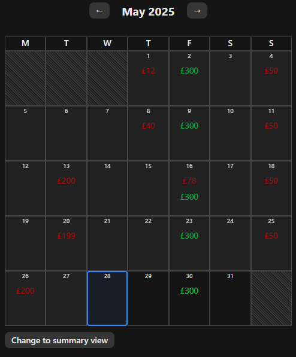
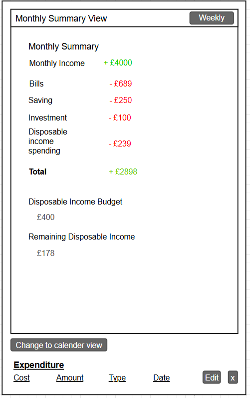

# Finance Tracker - Personal Finance Dashboard
## Project Overview
Monthly Finance Tracker is a secure, real-time, full-stack web application that empowers users to take full control of their personal finances. Designed with a strong focus on usability, performance, and data privacy, the app provides a streamlined one-page dashboard for tracking income, expenditures, and disposable income in a clear, calendar-driven format.

This project was built as both a portfolio piece and a production-grade system, emphasizing strong frontend architecture, secure backend API design, and real-world performance considerations.

Built using React (frontend), Django REST Framework (backend) and PostgreSQL, the system supports full CRUD operations on all financial entries and intelligently handles recurring transactions. It also includes features like monthly budgeting, weekly and monthly financial summaries, and dynamic currency symbol formatting — all personalized per user.


### Key Features
- One-Page Dashboard
    - Toggle between calendar, weekly, and monthly summaries with real-time financial insights.
- Dynamic Calendar View
    - Interactive financial calendar with accurate date alignment, showing income and expenditure breakdowns per day.
- Income and Expense Tracking
  - Log and manage both one-time and recurring income/expenditures, with automatic generation of future instances based on repeat frequency.
  - Create, edit, and delete financial entries with support for recurring transactions (weekly & monthly). Repeats are automatically generated with logic to avoid duplicate or outdated entries.
- Disposable Income Budgeting
  - Set and track monthly disposable income budgets. Each new month resets automatically and can be adjusted by the user.
- Data Privacy and Security
  - Each user’s data is completely isolated and protected. Every financial endpoint is protected by ownership-based permissions — ensuring users can only access their own data. No shared access is possible.
- Currency Personalization
  - Users can choose their preferred currency, which is reflected across all financial data outputs and summaries.
- JWT Authentication
  - Auth flow is powered by `dj-rest-auth` and `SimpleJWT`, ensuring secure access to all financial data. 
  - Upon login, tokens are stored in secure, `HttpOnly` cookies, protecting them from XSS attacks. Auth state is managed in React context and persists across page reloads by verifying the authenticated user via `/dj-rest-auth/user/`. 
  - This approach offers the security of cookies with the convenience of automatic session restoration, while fully avoiding token exposure to client-side JavaScript.
- Performance Optimized UI
  - Built with reusable React components and minimal re-renders to ensure snappy performance across devices.

### Tech Stack
| **Layer** | **Technology** | **Purpose** |
|--|--|--|
| Frontend | React, React Router, Axios | SPA interface with dynamic component rendering |
| Backend | Django, Django REST Framework | REST API with secure user-specific endpoints |
| Auth | dj-rest-auth, SimpleJWT | JWT-based login, logout, password updates |
| Database | PostgreSQL | Structured, relational financial data |
| Deployment | Heroku (API), Netlify (Frontend) | Full-stack hosting |


# Table of Contents
- [Project Overview](#project-overview)
- [UX Strategy & Goals](#the-strategy-plane)
    - [Site Goals](#site-goals)
- [Project Scope & User Stories](#project-scope--user-stories)
    - [Agile Planning](#agile-planning)
    - [Epics](#epics--user-stories)
- [Application Features & Functionality](#application-features--functionality)
    - [Features](#features)
    - [Unimplemented Features](#unimplemented-features)
    - [Future Features](#future-features)
- [System Architecture & Design](#system-architecture--design)
    - [Wireframes](#wireframes)
    - [Database Design](#database-design)
    - [Security](#security)
- [Visual Design & Styling](#visual-design--styling)
    - [Design](#design)
    - [Colour Scheme](#color-scheme)
    - [Typography](#typography)
- [Technologies](#technologies)
    - [Technology Used](#technology-used)
    - [Python Modules Used](#python-standard-modules)
    - [External Python Modules Used](#external-python-modules)
- [Testing](#testing)
- [Bugs](#bugs)
    - [Fixed Bugs](#fixed-bugs)
    - [Unfixed Bugs](#unfixed-bugs)
- [Deployment](#deployment)
    - [Version Control](#version-control)
    - [Heroku Deployment](#heroku-deployment)
    - [Run Locally](#run-locally)
    - [Fork Project](#fork-project)
- [Credits](#credits)

# UX Strategy & Goals
> The Strategy Plane

## Site Goals
The primary site goal is to provide users with a clear, responsive, and efficient dashboard for managing their personal finances — including income, expenses, and disposable income — through an interactive, data-driven interface that simplifies financial awareness and planning.

### Functional Goals
- Allow users to securely register, log in, and log out
- Enable users to add, edit, and delete income and expenditure records
- Support repeatable transactions (weekly and monthly) that automatically generate future entries
- Provide a monthly and weekly summary view with aggregated totals
- Present a dynamic calendar view that reflects financial activity per day
- Allow users to set and track a monthly disposable income budget
- Let users track discretionary spending against their budget
- Enable users to set and store their preferred currency symbol
- Display financial data consistently and responsively across devices
- Deliver user feedback on actions (form validation, success messages, error handling)

### User-Centric Goals
- Understand where their money is going at a glance
- Track how much they’ve spent or saved in a specific time period
- Identify spending habits or recurring costs over time
- Set and stay within a self-defined spending limit (budgeting)
- Access their financial data securely from any device
- Experience a fast, mobile-friendly, intuitive interface
- Avoid repetitive data entry through smart automation (repeat logic)
- Trust that their data is private, accurate, and never shared
- Have a clear and visual representation of their finances

### Business & Technical Goals
- Build a modular, maintainable codebase following component-based design
- Ensure full CRUD functionality and secure user authentication
- Adhere to accessibility best practices and responsive design  principles
- Follow DRY, KISS, and separation-of-concerns coding practices
- Use Django REST Framework to expose a secure, structured API
- Enforce strict data permissions so users can only access their own records
- Implement environment variable-based secret handling for deployment security
- Deploy both frontend and backend to cloud platforms
- Protect all user-specific data using secure cookie-based authentication and CSRF safeguards

# Project Scope & User Stories
> The Scope Plane

## Agile Planning
This project was managed using an Agile approach with GitHub Projects to break the work into prioritized user stories and organize them into epics. 

The total time for all features to be implemented was 7 weeks, with an additional 2 weeks for refactoring, testing and documentation.
This project was split up into 4 sprints, each being just over 2 weeks.

Each card represents a feature or task, and progress was tracked using a Kanban board with the following columns:
- Backlog – New user stories and ideas
- To Do – Selected for development in the next sprint
- In Progress – Features actively being built
- Done – Completed and tested tasks

This approach allowed me to remain flexible throughout development, prioritize based on core user needs, and continuously deliver working features. All user stories were tagged with their relevant epic and updated throughout the build.

[View the GitHub Kanban Board](https://github.com/users/SemMTM/projects/3/views/1)

## Epics & User Stories
This project had 8 epics that user stories were categorised into:

### Authentication
Enable secure user login and logout using JWT HttpOnly cookie authentication. Required for accessing any user-specific financial data.

<details>
<summary>Click to view user stories</summary>

- As a developer, I can implement JWT Auth, so that my users are more secure and don't have to log in every time to use the app.
- As a user, I can create an account using social logins, so that creating an account is faster
- As a developer, I can verify users emails with email verification so users can secure their accounts better
- As a user, I can sign in to my account, so that I can access my finance tracker
- As a user, I can create an account, so that I can use the app and all of its features

</details>

### Budgeting
Ability to set and track monthly disposable income budgets and disposable spending. 

<details>
<summary>Click to view user stories</summary>

- As a user, I can edit my disposable income budget, so I can make changes when needed
- As a dev, the disposable income remaining resets each month
- As a user, I can see my remaining disposable income for the month, so I can easily manage my spending
- As a user, I can set a monthly disposable income budget, so that I can manage my spending
- As a user, I can see a list of all of my disposable income spending entries with details, so that I can see my spending
- As a user, I can delete a disposable income spending entry, so that I can keep my financial tracking accurate
- As a user, I can edit my disposable income spending entries, so that I can make changes if needed
- As a user, I can add my disposable income spending to the list, so that I can manage my finances.

</details>


### Documentation & Testing
Create clear README documentation, manually test all frontend and backend features, write extensive backend unit tests.

<details>
<summary>Click to view user stories</summary>

- As a developer, I will manually test all frontend and backend features, to ensure no bugs are present in the app
- As a developer, I will write a full suite of unit tests for all backend views, serializers and utility file, so that I can ensure everything functions as intended.
- As a developer, I will create the README documentation structure, I that I can ensure the app is well documented
- As a developer, I will add all content to the README, so the app is properly documented.

</details>

### Income & Expenditure Management
Allow users to add, edit, delete, and repeat income and expenditure records. Ensure permissions and repeat logic work as expected.

<details>
<summary>Click to view user stories</summary>

- As a user, I can set a category on an expenditure, so that I can categorise my spending
- As a user, I can repeat an expenditure payment, so I don't have to enter it again every month
- As a user, I can repeat an income payment, so I don't have to enter it again every month
- As a user, I can see a list of this months incomes with details, so that I can manage my income
- As a user, I can see a list of all of my expenditure entries with details, so that I can see my spending easier
- As a user, I can delete an expenditure entry, so that I can keep my financial tracking accurate
- As a user, I can edit my expenditure entries, so that I can make changes if needed
- As a user, I can edit my incomes, so that I can make changes if needed
- As a user, I can add my income to the list, so that I can manage my finances
- As a user, I can add my expenditure, so that I can manage my finances

</details>

### Setup
Initial setup of the project structure, authentication configuration, CORS, environment variables, and deployment settings.

<details>
<summary>Click to view user stories</summary>

- Purchase a domain and set up the API and Front end on the same top level domain so cookies work on mobile
- Create views to return data from API
- Create serializers for all models
- Connect the frontend to the API
- Set up database and relationships
- Set up API and connect it to the database so receive new entries

</details>

### Summary Views
Calendar, weekly, and monthly summaries showing financial activity at a glance.

<details>
<summary>Click to view user stories</summary>

- As a user, the month on the calendar view changes automatically, so that I don't have to manually change it each month
- As a user, I can easily see which day we are on as it is highlighted
- As a user, I can see a calendar view with all of my monthly finances plotted on it by day, so that I can visually see my finances
- As a user, I can switch between weekly and monthly summaries, so that I can see more detailed breakdowns of my finances
- As a user, I can see a weekly breakdown of all finances for the month, so that I can manage my weekly spending
- As a user, I can see a monthly financial summary view of that months finances, so that I can easily manage my finances

</details>

### User Settings
Enable users to update their username, email, password, and preferred currency, with all changes reflected throughout the app.

<details>
<summary>Click to view user stories</summary>

- As a user, I can reset my password via email if i forget it, so I do not lose access to my account
- As a user I can toggle dark or light mode so that I can customise the appearance of my financial tracker
- As a user I can set/change the currency on my tracker
- As a user, I can change/add an email on my account, so that I can secure my account
- As a user, I can change my username, so I can edit my account log in info
- As a user, I can change my account password
- As a user, I can access a settings page, so I can change details about my account

</details>


[Back to Table of Contents](#table-of-contents)

# Application Features & Functionality
> The Structure Plane

## Feature: Calendar Grid View
### Overview
The Calendar Grid View provides users with a clear, visual layout of their financial activity across the selected month. It aligns each day to its correct weekday and displays total income and expenditure per day, helping users spot trends, plan ahead, and track spending at a glance.



### Technical Breakdown

<details>
<summary><strong>View Technical Breakdown</strong></summary>

**Frontend Implementation**
- The `CalendarView` component generates a 5 or 6-row calendar layout using the `generateCalendarGrid()` utility. The utility calculates the correct start day of the month and fills in the grid to ensure five full rows are always rendered (35 cells).
- This function accounts for:
    - The weekday index of the first day of the selected month
    - The number of days in the month
    - Leading and trailing blank cells to ensure proper weekday alignment
- The `CalendarView` component maps over this grid to render each day in the correct position using a responsive CSS Grid layout.
- Each day is represented as a tile with date, income, and expenditure displayed using colored badges.
- The current day is highlighted, providing instant visual orientation no matter which month the user is viewing.
- Days outside the selected month are visually greyed out, maintaining structure while helping users focus only on current-month data.
- Data is fetched from the `/calendar-summary/` API via Axios and rendered dynamically when the user navigates between months using prev/next controls.
- `useCalendar()` context manages the selected date and navigation logic (previous/next month), ensuring global state sync.

**Backend Implementation**
- `CalendarSummaryView` receives year and month as query parameters and returns a dictionary of day-by-day totals for the authenticated user.
- Values are raw integers in pence, with currency symbols handled client-side for consistency and formatting flexibility.
- Permissions restrict access to the user’s own income and expenditure records.

**Data Flow & Interactivity**
- On mount or month change, the frontend sends a GET request with the selected year and month.
- The backend aggregates financial data per day and returns it to the client.
- The calendar updates reactively, and the grid always renders 5 rows regardless of month length or start weekday, preserving layout stability.

</details>

### UX & Performance Benefits
- Maintains a consistent 5-row layout regardless of month length or starting weekday, preventing layout shifts and improving predictability
- Helps users build month-to-month memory of their financial rhythm by keeping tiles aligned
- Allows users to see daily financial activity at a glance with minimal scrolling
- Responsive across devices via CSS Grid
- Optimized rendering ensures only necessary re-renders and minimal DOM updates on month change
- Highlighted current day improves usability and time awareness during navigation

## Feature: Month Navigation & Change Handling
### Overview
The month navigation system allows users to move backward or forward in time to view their financial data for -5 or +5 months from the current month. 

This interaction updates not only the calendar grid, but also synchronizes all financial components — including expenditure lists, income, budget, and summaries — to reflect the selected period. It acts as the global time controller for the entire application.


### Technical Breakdown

<details>
<summary><strong>View Technical Breakdown</strong></summary>

**Frontend Implementation**
- Centralized in the custom `useCalendar()` context, which exposes:
    - selectedDate — the currently viewed month/year
    - `goToPreviousMonth()` and `goToNextMonth()` — handlers to shift month state
    - `isAtStart` and `isAtEnd` — booleans to limit navigation bounds
- When navigation is triggered:
    1. The `selectedDate` is updated across the app
    2. All components that consume selectedDate (via `useCalendar()`) re-fetch data for the new month
 3. These components include:
    - `CalendarView`
    - `ExpenditureList`
    - `IncomeList`
    - `DisIncomeBudget`
    - `DisIncomeSpendList`
    - `MonthlySummary` and `WeeklySummary`
- This keeps the entire UI in sync with the selected month with minimal duplication of logic or state.

**Backend Implementation**
- Each financial endpoint receives the selected month as a single string in YYYY-MM format (e.g. "2025-04"). This is parsed server-side to filter the user's records for that month only.
- For example:
    - `/calendar-summary/?month=2025-05`
    - `/expenditure/?month=2025-05`
- These endpoints return only the data relevant to the current month, improving performance and clarity.

**Data Flow & Interactivity**
- When a user changes the month:
    - The context date updates globally
    - All consuming components re-fetch their data based on the new date
    - The entire dashboard then reflects one unified time window

</details>

### UX & Performance Benefits
- Creates a seamless, intuitive way to explore historical financial data without navigating away from the dashboard
- Reduces user error and confusion by ensuring all components reflect the same time period
- Avoids unnecessary re-renders by centralizing month logic in a context provider
- Improves maintainability by decoupling date state from individual components
- Enables scalable future enhancements, like yearly views or date range comparisons

## Feature: Monthly Summary View
### Overview
The Monthly Summary View gives users a high-level overview of their income, expenditures, and remaining disposable income for the selected month. This view enables users to evaluate their financial position without having to interpret individual transactions — supporting better budgeting and financial awareness at a glance.


### Technical Breakdown

<details>
<summary><strong>View Technical Breakdown</strong></summary>

**Frontend Implementation**
- The `MonthlySummary` component consumes the globally shared `selectedDate` from `useCalendar()`.
- On mount or when the month changes, the component triggers a request to the `/calendar-summary/` API with the current month formatted as `YYYY-MM` (e.g., "2025-04").
- The returned summary data includes:
    - Total income for the month
    - Total expenditure, broken down by type
    - Remaining disposable income
    - Disposable income budget
    - Currency symbol (e.g., £)
    - A summary of income - expenditures
- The component displays this data in a styled summary card.
- A button inside the summary view allows users to toggle to the weekly summary view (`WeeklySummary`), which uses the same data source but breaks it down by week.

**Backend Implementation**
- The CalendarSummaryView endpoint handles GET requests and extracts the month parameter (formatted as YYYY-MM).
- The view filters the authenticated user’s `Income` and `Expenditure` entries for the selected month using `date__year` and `date__month`.
- The raw values (stored as integers in pence) are returned along with the user’s currency symbol, which is resolved using the user’s preference and the `get_currency_symbol()` utility.

**Data Flow & Interactivity**
- The summary data is updated dynamically every time the month is changed using the calendar navigation arrows.
- The values are displayed using local component state and are re-rendered automatically via `useEffect()` when the data is fetched.
- The `MonthlySummary` view passes control to the `WeeklySummary` component when toggled, using a shared `viewMode` state in the parent component (`Home`).

</details>

### UX & Performance Benefits
- Offers users an immediate understanding of their financial balance for the selected month
- Encourages budgeting discipline by surfacing disposable income as a single, focused value
- Reactively updates when the month is changed, ensuring a seamless and predictable experience
- Minimizes DOM updates and improves performance by re-rendering only the summary card

## Feature: Weekly Summary View
### Overview
The Weekly Summary View allows users to view a breakdown of their income and expenditure on a week-by-week basis within the selected month. It intelligently includes partial weeks as long as they fall within the selected month’s boundaries — ensuring no financial data is missed due to alignment quirks in the calendar. This enables more granular tracking of spending patterns, especially useful for users paid weekly or budgeting with short-term goals.


### Technical Breakdown

<details>
<summary><strong>View Technical Breakdown</strong></summary>

**Partial Week Logic**
- Weeks in the calendar don’t always align perfectly with the start or end of a month. For example:
    - May 2025 starts on a Thursday → the week starting Monday, April 28, partially belongs to May.
    - May 2025 ends on a Saturday → the week starting Monday, May 26, extends into June.
- Instead of excluding these weeks entirely or returning their full 7-day span, the system returns a partial summary:
    - Only the subset of days within the selected month is included in calculations.
    - This allows weeks like 2025-04-28 – 2025-05-04 to be shown, but only the transactions from May 1 to May 4 are counted.
    - Likewise, the week of 2025-05-26 – 2025-06-01 only includes May 26 to May 31.

**Frontend Implementation**
- The `WeeklySummary` component is conditionally rendered when the user toggles from the `MonthlySummary` using the `summaryMode` state in the parent `Home` component.
- It consumes the globally shared `selectedDate` from `useCalendar()` and calculates the current week’s start date using a utility function (e.g. based on ISO week rules or first visible week).
- A GET request is sent to the `/weekly-summary/` API with the selected week start date passed in YYYY-MM-DD format as a query parameter (?week_start=2025-05-06).
- The response includes:
    - Total weekly income
    - Total weekly expenditure
    - Currency symbol

**Backend Implementation**
- The `WeeklySummaryView` accepts the week_start parameter and computes the 7-day range:
`week_start <= date < week_start + 7 days`
- Before aggregating values, the backend further filters to ensure that only records within the selected month are included.
- For example, if `week_start = "2025-04-28"`, the backend excludes `2025-04-28, 2025-04-29, and 2025-04-30` when summarizing for May.
- This logic prevents misleading data when weeks straddle two months.

**Why This Filtering Matters**
- Prevents confusion caused by partial overlaps (e.g. a user selecting May shouldn’t see income from April 30th in the summary)
- Ensures data integrity — each week’s total aligns strictly with the active calendar month
- Aligns with the calendar grid and monthly summary to give a coherent user experience

**Data Flow & Interactivity**
- The summary data is updated dynamically every time the month is changed using the calendar navigation arrows.
- The values are displayed using local component state and are re-rendered automatically via `useEffect()` when the data is fetched.
- The `MonthlySummary` view passes control to the `WeeklySummary` component when toggled, using a shared viewMode state in the parent component (`Home`).

</details>

### UX & Performance Benefits
- Gives users a more granular view of their financial activity, perfect for tracking short-term trends or weekly goals
- Complements the Monthly Summary by providing more focused insight without requiring manual filtering
- Keeps the interface clean by toggling summaries instead of showing both at once
- Optimized for mobile and desktop with minimal render overhead
- Ensures consistency by sharing context and formatting logic with the Monthly Summary

## Feature: Monthly Expenditures List
### Overview
The Monthly Expenditures List displays a scrollable, filterable view of all user expenses for the selected month. It forms the core of the app’s transaction tracking system, showing amounts, titles, dates and expenditure types — all in the user’s chosen currency. Each expenditure is interactively linked to the calendar view and supports editing, deletion, and intelligent repeat logic across months.


### Technical Breakdown

<details>
<summary><strong>View Technical Breakdown</strong></summary>

**Frontend Implementation**
-  Component: `ExpenditureList`
- Fetches and renders all user expenditures for the currently selected month, using context from `useCalendar()` to construct the query.
- Data Fetching
    - Sends a request to `/expenditures/?month=2025-05` (e.g.) to retrieve entries.
    - Returned results are ordered by date (earliest to latest) for easy readability.
- Repeat Entry Handling
    - When a repeating expenditure is created, the backend pre-generates entries for the next 6 months (weekly or monthly based on interval).
    - These repeats are stored in the database with a shared `repeat_group_id`, enabling grouped edits or deletions.
- Calendar Plotting
    - Each expenditure is visually plotted on the `CalendarView`, where:
        - Days with one or more expenses show a total amount indicator
        - This view dynamically reflects expenditure changes via React state sync and backend filtering by day.
- Editing Logic
    - Each list item includes an edit icon which opens a modal.
    - Users can modify title, amount and date.
    - On submit, a PUT request updates the entry — and if part of a repeat group, users are prompted whether to update just this entry or all future entries in the group.
    - Edits propagate across repeat entries based on date and group ID, updating future items only (preserving historical accuracy).

**Backend Implementation**
- ViewSet: `ExpenditureViewSet`
    - Uses custom `get_queryset()` logic to filter data by month string (YYYY-MM) and user.
    - Expenditures are ordered by date, and only the requesting user’s records are accessible.
- Repeat Generation
    - Repeat entries are generated at creation time using a utility function.
    - The function pre-generates dates up to 6 months ahead, excluding past or duplicate records.
    - On edit/delete, future records in the repeat group (`repeat_group_id`) are updated or removed using bulk query logic.
- Calendar Data Sync
    - The `/calendar-summary/` endpoint receives the same month string (`?month=2025-05`) and calculates daily totals for display.
    - This data directly powers the plotting logic on the calendar view using income/expenditure aggregation.

</details>

### UX & Functional Benefits
- Intuitive and Immediate: Changes to expenditure entries reflect across all areas of the app.
- Smart Repeat Management: Users have full control over recurring expenses, reducing data entry while maintaining accuracy.
- Financial Clarity: The combination of list and calendar visibility gives a clear breakdown of when and how money is spent.
- Secure by Design: Only the authenticated user can view, edit, or delete their records. All repeat logic is scoped to ownership and future dates.
- Real-world Practicality: Partial updates to recurring bills, mid-month cancellations, and adjustments are handled without data loss or conflict.

## Feature: Monthly Income List
### Overview
The Monthly Income List displays all income entries for the selected month in a clean, scrollable format. It allows users to view, add, edit, and delete recurring or one-time income items while reflecting changes instantly in both the summary and calendar views.


### Technical Breakdown

<details>
<summary><strong>View Technical Breakdown</strong></summary>

**Frontend Implementation**
- Implemented in the `IncomeList` component, this section fetches income data using the current month from the global `CalendarContext`.
- Each income entry is rendered as a list item showing:
    - Title
    - Date
    - Amount (formatted with currency symbol)
    - Edit button
- A button allows users to open a modal to add a new income item. The modal supports specifying:
    - Title
    - Amount (auto-converted to pence)
    - Date
    - Repeat interval (none, weekly, or monthly)
- Edit and delete operations are also handled via modals, with updates propagated across the UI through the central state refresh context.
- The repeat interval is pre-filled when editing an existing recurring income.

**Backend Implementation**
- The `IncomeViewSet` exposes full CRUD functionality for authenticated users.
- When a new income with a repeat interval is created:
    - A repeat group ID is assigned
    - All future repeat entries (weekly or monthly) are auto-generated for the next 6 months
- The backend filters income records by owner and selected month, parsed from the `?month=YYYY-MM` query parameter.
- If a recurring income is updated, the backend adjusts all future instances within the repeat group.
- Deleting a recurring income removes all future occurrences.

**Data Flow & Integration**
- When the month changes, a new request is made to `/income/?month=YYYY-MM`, returning all relevant records for that period.
- Income updates trigger a global state refresh using a React context, ensuring:
    - The monthly summary recalculates all summaries
    - Calendar view updates daily income tiles
    - The income list reflects current data without page reloads

</details>

### UX & Performance Benefits
- Enables granular control over income records with editable repeat schedules
- Visualizes recurring income patterns month-to-month
- Synchronizes with all other views (summary and calendar) for real-time accuracy
- Modal-based interaction ensures smooth UX with no full-page transitions
- Currency formatting improves clarity, with data stored in pence for precision
- Centralized data context keeps the UI reactive and avoids redundant fetches

## Feature: Repeat Entry Logic
### Overview
When a user creates a new entry with a repeat interval (weekly or monthly), the system immediately generates repeated instances for the next 6 months, starting from the entry's date. This ensures the calendar and summaries are pre-filled with all upcoming occurrences.


### Technical Breakdown

<details>
<summary><strong>View Technical Breakdown</strong></summary>

### generate_monthly_repeats_for_6_months
**What It Does:**
- Creates monthly duplicates of a given entry (e.g. income, expenditure) for the next 5 months after the original.
- Each new entry:
    - Copies the same amount, title, type (if applicable), and repeat group ID.
    - Adjusts the date to the same day in the next month using `relativedelta(months=1)`.

**Edge Case Handling:**
- Automatically adjusts day values if a month doesn't have the same number of days.
(Example: January 31st → February 28th or 29th)

**Used When:**
- A user submits a new entry with repeated='MONTHLY'.

### generate_weekly_repeats_for_6_months
**What It Does:**
- Creates weekly duplicates of the original entry by stepping forward 7 days at a time from the entry's date.
- Continues generating until the end of the 6th visible month.

**Repeat Grouping:**
- All generated entries share the same `repeat_group_id` (UUID), making it possible to identify and update/delete future entries as a group later.

**Used When:**
- A user submits a new entry with `repeated='WEEKLY'`.

</details>

### UX & Performance Benefits
- Set Once, Repeat Automatically
    - Users only need to configure a repeat interval once — future entries are instantly generated.
- Consistency Across Views
    - Repeated entries appear seamlessly across the calendar, summaries, and list views, ensuring a unified experience.
- Minimizes Manual Input
    - Reduces user workload by eliminating the need to manually create identical future entries.
- Handles Edge Cases Smoothly
    - Automatically adjusts for month-length variations (e.g. Feb 30 → Feb 28) and prevents invalid repeats.
- Bulk Creation = Fast Performance
    - Uses batch operations to insert future entries efficiently with minimal strain on the database.


## Feature: Disposable Income Budget
### Overview
The Disposable Income Budget section allows users to define how much flexible spending money they want to allocate for the selected month. It acts as a planning and constraint mechanism, helping users measure their actual spending against a self-imposed limit. This budget then integrates into the monthly and weekly summaries for clear comparisons. A "Remaining" amount can be seen next to the budget.


### Technical Breakdown

<details>
<summary><strong>View Technical Breakdown</strong></summary>

**Frontend Implementation**
- Handled in the `DisIncomeBudget` component, which:
- Fetches the budget for the currently selected month on mount (via `?month=YYYY-MM`)
- Displays the current budget amount with a currency symbol
- Offers a button to open a modal where the user can edit or reset the monthly budget
- The edit modal:
    - Defaults to the current budget value
    - Allows updating the amount
- All updates trigger a global context refresh that updates:
    - Monthly summary
    - Weekly summary
    - Any disposable income spending displays
- User input is stored in pounds but auto-converted to pence before being sent to the API
- Displays the "Remaining" disposable budget after disposable spending has been subtracted from the users assigned budget

**Backend Implementation**
- Managed via the `DisposableIncomeBudgetViewSet`, which:
- Allows only one entry per user per month
- Enforces uniqueness through queryset filtering and validation
- Creates a new entry at the start of each month (default amount: 0) via a monthly check
- Validates that only the owner can view or edit their own budget
- `PUT` requests allow updating the current month’s value
- Resetting is handled by submitting 0 as the new value
- Calculates remaining disposable budget 

**Data Flow & Integration**
- The component listens to month changes from the global `CalendarContext` and re-fetches budget data on each change
- All changes update the centralized refresh context, ensuring:
    - Summary components reflect updated available budget
    - Disposable income spending comparisons remain accurate
    - Budget editing always targets the correct month entry

</details>

### UX & Performance Benefits
- Gives users a clear self-defined spending cap each month
- Editable via intuitive modal with pre-filled values
- Synchronized with all summary views to show remaining budget after spending
- Lightweight data model ensures quick fetches with no pagination needed
- Monthly auto-generation ensures continuity with no gaps or missing data
- Encourages better financial planning without needing to define formal categories

## Feature: Disposable Income Spending List
### Overview
This section tracks flexible, non-essential purchases that count against the user's monthly disposable income budget. It provides transparency over where discretionary money is going, helping users stay within self-set limits while still enjoying their budgeted spending freedom.

Displayed in a list below the budget section, it enables fast add/edit/delete actions with real-time updates to the remaining balance in both monthly and weekly summaries.


### Technical Breakdown

<details>
<summary><strong>View Technical Breakdown</strong></summary>

**Frontend Implementation**
- The `DisIncomeSpendList` component:
    - Fetches all spending entries for the currently selected month on mount or when the calendar date changes
    - Displays each item’s title, date, and amount in a clean vertical list
    - Automatically refreshes when a new entry is added or deleted
- Add/Edit Modal:
    - Opens via a button
    - Form includes title, amount (entered in pounds, auto-converted to pence), and date
    - Validates for non-blank title and valid numeric input
    - Uses the same modal component system as other financial sections (consistent UX)
- When an item is added or edited:
    - A POST or PUT request is sent to the API
    - The global context is refreshed, ensuring:
    - Updated summary views (monthly/weekly)
    - Accurate remaining budget calculation
    - Calendar view remains consistent
- No repeat functionality is present in this section — every entry is standalone and user-defined

**Backend Implementation**
- Managed by the `DisposableIncomeSpendingViewSet`:
    - Supports full CRUD operations
    - Automatically filters entries by the authenticated user
    - Accepts optional `?month=YYYY-MM` query to return filtered data per month
    - Converts and stores amount values in pence for precision, regardless of how input is submitted
    - Enforces permissions: users can only interact with their own records
    - Does not include any repetition logic, aligning with its "ad-hoc expense" nature

**Data Flow & Integration**
- Triggered by month selection in the global `CalendarContext`
- When the month changes, spending entries are refetched to reflect the new period
- Adding, editing, or deleting a spending entry triggers:
    - UI update of the spending list
    - Context refresh to update:
        - Disposable Income Budget summary
        - Calendar tile amounts
        - Weekly and Monthly summary totals
        
</details>

### UX & Performance Benefits
- Allows users to track personal, lifestyle-oriented spending distinct from fixed expenses
- Fully integrated with remaining budget display — gives users an instant sense of spending freedom or overuse
- Fast, reactive UI with no full-page reloads
- Consistent modal and button styling across all sections builds user familiarity
- Easy to manage: no repeat logic to worry about, just add what you spent and when
- Minimalist design prevents visual clutter and supports focus on meaningful patterns

## Feature: Settings Dropdown
### Overview
The Settings Dropdown, accessible via a button in the top-left corner of the homepage, provides users with quick access to essential account management tools. Each action is handled within a dedicated modal, preserving context while avoiding unnecessary navigation. These settings support user customization and account maintenance, improving long-term app usability and retention.


### Technical Breakdown

<details>
<summary><strong>View Technical Breakdown</strong></summary>

**Frontend Implementation**
- The `SettingsDropdown` component:
    - Renders a settings button that toggles a dropdown menu on click
    - Dropdown includes options:
        - Change Username
        - Change Email
        - Change Password
        - Select Currency
    - Each item opens a modal powered by a shared modal system that dynamically loads the correct form
- Global modal context ensures modals stack correctly and close independently without interfering with other components
- Every modal:
    - Validates user input
    - Displays success/error feedback based on API response
    - Updates user context state if needed (e.g., after username or email change)

**Backend Integration**
- All modals interact with Django views secured by authentication
- Updates reflect in `/dj-rest-auth/user/` immediately after a successful change
- Currency changes update financial formatting across the app
- All endpoints return clear error messages which are parsed and displayed in the frontend
</details>


**Change Username Modal**


- Allows the user to update their username while preserving uniqueness and input format
- Frontend validates:
    - Non-empty input
    - Max 40 characters
    - Letters, numbers, hyphens, and underscores only
    - Username is unique
- Backend returns field-level validation errors if format/uniqueness is violated
- On success:
    - Updates user context
    - Modal closes with a success message
- Feedback is immediate and visible without refreshing the page

**Change Email Modal**


- Enables users to update their email address securely
- Validates that:
    - Email is in a valid format
    - New email is not the same as the current one
    - Email is not linked to another account
- Backend processes email change and returns success/failure response
    - On success:
    - Modal closes and success message appears
    - Email in user context is updated

**Change Password Modal**


- Form includes:
    - Current password
    - New password
    - Confirm new password
- Frontend checks for matching new/confirm fields
- Backend checks:
    - Password strength
    - Correct current password
- On success:
    - Modal closes and success message appears
- On failure:
    - Field-level errors displayed (e.g., incorrect password, too short)

**Currency Selection Modal**


- User can select from a list of supported currencies (e.g., GBP, USD, EUR)
- Selection updates:
    - Backend: stores user's choice
    - Frontend: user context updates after auto refresh
    - Currency symbol used across summaries, calendar tiles, and entries updates after auto refresh
- Modal uses a simple dropdown and confirmation button

**Light/Dark Mode**


- Users can switch between dark and light themes
- The selected theme is saved in `localStorage` and persists across sessions
- All UI components adjust styles instantly without requiring a reload
- Improves accessibility and visual comfort across lighting environments

### UX & Performance Benefits
- Keeps account settings readily accessible from any screen
- Avoids disrupting user flow — all changes happen in context via modals
- Clear visual hierarchy and feedback promote user confidence
- Minimizes page reloads and improves perceived performance
- Modular implementation allows new settings to be added easily

## Feature: Edit Entry Modal
### Overview
The Edit Modal allows users to update individual income, expenditure, disposable income entries and the disposable budget from a central UI. The modal appears as a popup over the current list view and lets users update title, amount, date, and (where applicable) type. The system is built to handle both one-time entries and repeating entries, intelligently updating future records where required.


### Technical Breakdown

<details>
<summary><strong>View Technical Breakdown</strong></summary>

**Frontend Implementation**
- All edit buttons open a shared `Modal` pre-populated with existing values via React state.
- Each list (income, expenditure, spending) passes down the correct entry data and triggers the modal when the edit icon is clicked.
- The form includes:
    - Title field
    - Amount input (with real-time currency formatting)
    - Date picker
    - Type selection (for expenditure only)
- Submitting the form triggers a PUT request to the relevant API endpoint (/income/{id}/, /expenditure/{id}/, etc.).

**Repeat Logic Integration**
- If the edited entry is part of a repeating group:
    - If only content is changed (title, amount, type): all future entries in the same group are updated to match and assigned a new group ID.
    - If the date is changed: the current and all future entries in the group are deleted, and a new entry is created with the updated date. A fresh repeating sequence is then generated from this new date using helper logic.
- This ensures:
    - The user can change future financial plans without affecting past data.
    - Editing a repeat is intuitive and consistent with how calendar logic is applied.

**Backend Implementation**
- Each financial model’s `perform_update()` method checks whether the updated entry is repeated and whether the date field has changed:
    - If the date changed, it uses a shared `repeat_on_date_change()` utility function to:
        - Delete the current and future entries in the group.
        - Create a new instance with the updated form data.
        - Regenerate the repeat chain from that new date.
    - If only other fields changed, future entries are updated in place and assigned a new group ID to track the change.
- All updates are scoped to the authenticated user and protected by permission classes

</details>

### UX & Performance Benefits
- Keeps modal behavior fast and lightweight with no page transitions.
- Prevents unexpected group-wide changes by isolating past and future repeats.
- Provides power and flexibility to users who want to adjust their financial habits dynamically.

## Feature: Month Auto-Detection & Rollover Logic for Repeating Entries
### Overview
The financial tracker automatically manages recurring financial entries by detecting when a new month begins and ensuring all applicable weekly and monthly repeating entries are created on the newly available 6th month without manual user intervention. This allows users to set a repeat interval once and rely on the system to maintain future records automatically.

### Technical Breakdown

<details>
<summary><strong>View Technical Breakdown</strong></summary>

**How Month Auto-Detection Works**
- When the app initializes or restores a session, it makes a GET request to the `/dj-rest-auth/user/ endpoint`.
- This triggers the `check_and_run_monthly_repeat()` utility function, which determines whether new repeat entries need to be generated.

**Detection Logic**
- The system checks a `last_repeat_check` value stored on the user's profile, which tracks the last month repeat logic was executed.
- If the stored month differs from the current one (i.e. a new month has started), repeat generation is triggered.
- After running, the `last_repeat_check` is updated to the current month to prevent duplicate runs.

**How Rollover Generation Works**
- The `generate_6th_month_repeats()` function handles creating new entries for the 6th visible month (i.e. 5 months ahead of the current one).
- It searches for repeated entries (weekly and monthly) in the 5th visible month, calculates their next due date, and:
    - Clones the entry to the new date only if it doesn’t already exist.
    - Uses `bulk_create()` to insert all new entries efficiently.
- This ensures calendar views, summaries, and budget data are always populated in advance, maintaining app consistency without bloating the database

</details>

### UX & Performance Benefits
- Effortless Automation
    - Users only need to set a repeat once — future entries are handled automatically every month.
- Improved Financial Planning
    - Seeing up to 6 months of future data helps users plan spending and budgeting with clarity.
- No Duplicate Entries
    - Built-in checks prevent repeated entries from being duplicated during monthly rollovers.
- Efficient Backend Logic
    - Uses `bulk_create()` and scoped time windows to keep performance high and database writes minimal.
- Reliable Grouping
    - Each set of repeated entries shares a unique group ID, allowing for clean updates or deletions.

## Feature: Data Cleanup Logic
### Overview
To keep the database performant and relevant, the app includes automatic cleanup logic that removes outdated financial data (Entries outside of the 6-month viewing window). This ensures that the system remains fast and lightweight.

### Technical Breakdown

<details>
<summary><strong>View Technical Breakdown</strong></summary

**Backend Implementation**
- The cleanup logic is handled by the clean_old_transactions(user) utility function.
- Its is triggered when the `the check_and_run_monthly_repeat()` is triggered on month rollover.
- When triggered, it:
    - Calculates the start of the current month.
    - Subtracts 6 months to determine the cutoff date.
    - Deletes all financial entries (Income, Expenditure, DisposableIncomeSpending, DisposableIncomeBudget) for that user that are older than the cutoff.

</details>

### UX & Performance Benefits
- Faster Querying
    - Reduces the volume of old data scanned during API queries, improving response times.
- Maintains Storage Efficiency
    - Prevents unnecessary buildup of legacy data over time, keeping the database lean.

## Feature: Sign In Page
### Overview
The Sign In Modal provides a secure and user-friendly interface for logging into the financial tracker. It triggers a login request to the backend and, upon successful authentication, initializes the app by fetching the authenticated user's financial data for the selected month.


### Technical Breakdown

<details>
<summary><strong>View Technical Breakdown</strong></summary

**Frontend Implementation**
- An unauthenticated user trying to access any page, will be automatically redirected to the sign-in page.
- All routes are protected and only authenticated users are allowed to access the app.
- The page includes:
    - Email and password input fields
    - Client-side validation to prevent empty submissions
    - Display of backend error messages (e.g. invalid credentials)
- On submission, it calls the login endpoint (/dj-rest-auth/login/) via Axios.
- On success:
    - User credentials are stored in React context
    - Financial data is fetched

**Backend Implementation**
- The modal captures the user’s username and password via controlled form inputs.
- On form submission:
    - It sends a `POST` request to `/dj-rest-auth/login/` with the credentials.
    - The backend responds by setting JWT tokens in secure, `HttpOnly` cookies — these are automatically sent by the browser on subsequent requests.
- After login:
    - The frontend immediately calls `/dj-rest-auth/user/` to verify login and retrieve the authenticated user.
    - This also triggers the month auto-detection logic, ensuring recurring entries are generated if a new month has begun.
- Error messages from the backend (e.g. invalid credentials) are displayed directly in the modal.

**Authentication Security**
- Tokens are stored in HttpOnly cookies and never exposed to JavaScript.
- This eliminates the risk of token theft via XSS and provides the convenience of automatic cookie-based authentication for all subsequent API requests.

</details>

### UX & Performance Benefits
- Login is persistent across reloads unless manually logged out.
- The page ensures clear feedback on errors and provides a fast entry point into the app.
- Authentication is seamless and secure, with automatic token refresh handled by the backend.

## Feature: Sign Up Page
### Overview
The Sign Up Page allows new users to create an account with minimal friction. It’s designed with validation, user feedback, and security in mind, ensuring a smooth onboarding experience.


### Technical Breakdown


<details>
<summary><strong>View Technical Breakdown</strong></summary

**Frontend Implementation**
- The form collects:
    - Username
    - Email address
    - Password and Password confirmation
- On submission:
    - A POST request is sent to `/dj-rest-auth/registration/`.
    - If successful, the backend automatically logs the user in and sets JWT tokens in `HttpOnly` cookies.
    - The frontend then fetches `/dj-rest-auth/user/` to verify the session and initialize financial data.
- Validation:
    - Client-side: Basic required field checks and password confirmation.
    - Server-side: Built-in validation from dj-rest-auth, with error messages (e.g. weak password, username taken) displayed inline.

**Security Considerations**
- JWT tokens are never exposed to JavaScript.
- Authenticated sessions are automatically secured via `HttpOnly` cookies, and reused on each page load without exposing credentials or requiring localStorage.
- Password validation rules follow Django’s built-in password validators for strength and predictability.

</details>

### UX & Performance Benefits
- Immediate access after sign-up — no separate login step required.
- Realtime feedback on validation errors helps reduce frustration.
- Secure session is automatically established.
- Supports fast onboarding and full feature access from the first login.

## Unimplemented Features
Several features were not implemented due to time constraints and can be seen in the [backlog](https://github.com/users/SemMTM/projects/3).

The unimplemented features include:
- Social login 
- Email verification

## Future Features
Features that could be implemented in a future iteration are:
- Option to edit/delete just the current entry instead of all repeated version of the entry
- Clickable calendar tiles to show a detailed view of each days finances

[Back to Table of Contents](#table-of-contents)

# System Architecture & Design
> The Skeleton Plane

## Wireframes
### Add Entry Modal
<details>
<summary><strong>Click To View Wireframe</strong></summary>


</details>

### Calendar View
<details>
<summary><strong>Click To View Wireframe</strong></summary>


</details>

### Finance Lists
<details>
<summary><strong>Click To View Wireframe</strong></summary>


</details>

### Monthly Summary View
<details>
<summary><strong>Click To View Wireframe</strong></summary>



</details>

### Settings Modal
<details>
<summary><strong>Click To View Wireframe</strong></summary>


</details>

### Weekly Summary View
<details>
<summary><strong>Click To View Wireframe</strong></summary>


</details>

[Back to Table of Contents](#table-of-contents)

## Database Design
The Financial Tracker app uses a relational PostgreSQL database to manage user-specific financial data with strict data ownership and repeat automation logic. Django’s ORM handles data integrity, model relationships, and query abstraction. All financial models are linked to the authenticated user, ensuring complete data privacy.


### Key Models & Their Purpose
**User Model (Django’s built-in User)**
- Fields: `username`, `email`, `password`, etc.
- Purpose:
    - Manages authentication and user ownership of all financial data.
    - Linked to every core financial model (income, expenditure, budget, etc.) via a ForeignKey.
    - Used in combination with JWT authentication stored in secure HttpOnly cookies.

**UserProfile Model**
- Fields: user (`OneToOneField`), `last_repeat_check`
- Purpose:
    - Tracks when the repeat generation logic was last triggered for a user.
    - Ensures monthly repeat entries are only generated once per month.
    - Works with `/dj-rest-auth/user/` to trigger repeat generation automatically on login or session restore.
- Why It’s Needed:
    - Separates auxiliary user-specific data from the core User model.
    - Controls the repeat system in a scalable and isolated way.

**Income Model**
- Fields: `title`, `amount` (int, pence), `date`, `repeated`, `repeat_group_id`, `owner` (FK)
- Purpose:
    - Stores income entries for each user.
    - Supports optional weekly or monthly repeat logic.
    - Automatically generates repeated instances using utility functions.
    - Linked by repeat_group_id for group updates or deletions.
- Why It’s Needed:
    - Provides structured tracking of income with repeat support.
    - Integrates into calendar, summary, and budget systems.

**Expenditure Model**
- Fields: `title`, `amount` (int, pence), `type`, `date`, `repeated`, `repeat_group_id`, `owner` (FK)
- Purpose:
    - Stores expense entries with optional repeat behavior.
    - Includes a type field to distinguish between different spending categories.
    - Uses repeat_group_id to manage updates/deletions for recurring expenses.
- Why It’s Needed:
    - Tracks structured spending data.
    - Enables monthly and weekly summary breakdowns.
    - Supports long-term budget visibility through repeat automation.

**DisposableIncomeBudget Model**
- Fields: `owner` (FK), `amount` (int, pence)
- Purpose:
    - Allows users to define a monthly budget for flexible spending.
    - Only one entry is allowed per user per month.
    - Automatically resets each month with a default value of 0.
- Why It’s Needed:
    - Helps users set limits for their monthly discretionary spending.
    - Integrated into summaries for calculating remaining budget.

**DisposableIncomeSpending Model**
- Fields: `title`, `amount` (int, pence), `date`, `owner` (FK)
- Purpose:
    - Tracks ad-hoc discretionary purchases.
    - Each entry is tied to a date and shown against the user’s monthly budget.
    - Used to calculate remaining disposable income for each period.
- Why It’s Needed:
    - Enables users to log smaller, lifestyle-based purchases without cluttering main expenditure data.

**Currency Model**
- Fields: `currency`, `owner` (`OneToOneField`)
- Purpose:
    - Stores the user’s preferred currency code (e.g., GBP, USD).
    - Used across all views to format financial amounts.
    - Returns currency symbol through a backend utility function.
- Why It’s Needed:
    - Supports internationalization and user preference.
    - Keeps currency logic isolated from transactional data.

### Differences Between Live Database & ERD
There were some changes made to the database throughout the project after the Entity Relationship Diagram was created:

| Aspect | ERD | Live Database |
|--|--|--|
| UserProfile Model | Not present | Added as a standalone model linked via a `OneToOneField` for controlling monthly repeat logic (`last_repeat_check`). |
| Repeated Field Handling | Described loosely as “multi choice” | Implemented as `CharField` with choices for both `repeated` and `type`, improving validation and maintainability. |
| Repeat Group Tracking | Not present | Implemented using `repeat_group_id` (UUID) for grouping repeated entries across time, enabling batch updates/deletes. |
| Amount Fields | Shown as `int` | Implemented as `PositiveIntegerField` representing pence (1/100th of a pound). Ensures no negative values are stored and avoids floating-point errors. Formatting into pounds and appending currency symbols is handled in the serializer layer. |
| Currency Storage | Present but type unspecified | Uses a standard CharField and integrates with a custom currency utility that provides formatting and symbols. |

## Security
This financial tracker was built with a production-grade security posture in mind. From JWT cookie-based auth to Django's hardened middleware settings, every layer was implemented to protect user privacy, session integrity, and data ownership.

### Authentication & Session Security
- JWT-Based Auth with Secure Cookie Storage
    - Powered by `dj-rest-auth` and `SimpleJWT`
    - Access and refresh tokens are stored in `HttpOnly`, Secure cookies, not in `localStorage` or `sessionStorage`
    - Cookies are automatically sent with requests due to proper `SameSite` and `CORS` settings
    - JWT cookies are configured with:
        - `HttpOnly = True`
        - `Secure = True` (disabled only in local dev)
        - `SameSite = Lax` via `CSRF_COOKIE_SAMESITE` and `SESSION_COOKIE_SAMESITE`
- Shared Top-Level Domain Architecture
    - Both the API and frontend are hosted under the same top-level domain
    - Combined with `SameSite=Lax`, this architecture prevents CSRF attacks while allowing secure cross-path access
    - Example: cookies set at api.example.com can be sent with requests to app.example.com only when initiated by top-level navigations or safe HTTP methods (like GET)
- Session Flags Set in `settings.py`:

```
SESSION_COOKIE_SECURE = not DEBUG
SESSION_COOKIE_HTTPONLY = not DEBUG
SESSION_COOKIE_SAMESITE = os.environ.get("SAME_SITE")
CSRF_COOKIE_SECURE = not DEBUG
CSRF_COOKIE_SAMESITE = os.environ.get("SAME_SITE")
```

- Short Token Lifetimes
    - Access tokens expire after 60 minutes
    - Refresh tokens expire after 7 days, limiting session risk
- Refresh Token Blacklisting Enabled
    - When tokens are rotated, old refresh tokens are invalidated and blacklisted
    - This prevents session hijacking via stolen cookies

### CSRF Protection
- Django’s built-in CSRF protection is fully enabled and tied to secure cookie settings
- The frontend makes authenticated requests with `withCredentials: true`, allowing Django to validate the CSRF token
- This prevents forged `POST/PUT/DELETE` requests from malicious third-party origins

### Django Security Middleware Settings
HSTS is configured to enforce HTTPS for one year and is preload-ready, protecting against SSL stripping attacks even on first visit when used with a preload list. The following settings are enforced in production via settings.py, making the app compliant with modern security headers and transport standards:

| Setting |	Description |
|--|--|
| `SECURE_SSL_REDIRECT` |	Forces HTTPS in production |
| `SECURE_HSTS_SECONDS = 31536000` | Enforces HTTPS in browsers for 1 year, protecting users from SSL stripping (downgrade) attacks |
| `SECURE_HSTS_INCLUDE_SUBDOMAINS` | Extends HSTS protection to all subdomains |
| `SECURE_HSTS_PRELOAD` | Allows the domain to be submitted to the HSTS preload list, ensuring HTTPS is enforced even on a first visit |
| `SECURE_CONTENT_TYPE_NOSNIFF` | Blocks MIME-type sniffing |
| `X_FRAME_OPTIONS = "DENY"` | Prevents clickjacking by disallowing iframes |
| `SECURE_REFERRER_POLICY = "strict-origin-when-cross-origin"` | Limits Referer header data on cross-site requests |

### API Access Control
- Global Authentication Enforcement
    - All endpoints (calendar, income, budgets, etc.) require `IsAuthenticated`
    - Anonymous users receive `403` or `401` responses automatically
- Object-Level Authorization
    - Each `retrieve`, `update`, or `delete` operation checks if `obj.owner == request.user`
    - Unauthorized access triggers `PermissionDenied`
- Scoped Querysets
    - All financial queries are filtered by `owner=request.user`, fully isolating data between accounts

### Field-Level and Admin Protections
- Sensitive Serializer Fields Read-Only
    - Fields like `owner`, `repeat_group_id`, and timestamps are not writeable by the client
- Admin Route Hidden in Production
    - The Django admin interface is disabled in production. Attempting to access `/admin/` results in a `404` and a redirect to the homepage

### Security Testing
- Unit tests verify:
    - Only authenticated users can access protected endpoints
    - Users cannot access or modify other users' data
    - Unauthorized access attempts are properly denied with 403
- Auth and permission behaviors are validated throughout the backend test suite

### Environment & Secret Management
- All secrets (e.g. `DATABASE_URL`, `SECRET_KEY`) are stored in environment variables using `env.py`
- The `.env` and secret files are excluded via `.gitignore`
- No credentials or tokens have ever been committed to the Git history

[Back to Table of Contents](#table-of-contents)

# Visual Design & Styling
> The Surface Plane

### Design

### Colour Scheme

### Typography

[Back to Table of Contents](#table-of-contents)

# Technologies
This project combines a modern full-stack architecture built with React, Django REST Framework, and PostgreSQL. The frontend is powered by Vite, React Router, and TanStack React Query for fast, reactive UI rendering and efficient API state management. The backend uses Django with dj-rest-auth and SimpleJWT to provide a secure, token-based authentication system. Deployed on Netlify and Heroku, the application follows current best practices in scalability, performance, and modular code structure.

## Technology Used

### Full Stack Overview
| Technology | Purpose |
|--|--|
| React 19 | Frontend UI framework, used with hooks, modals, context |
| Django 5 | Backend API framework with authentication and business logic |
| Django REST Framework | Serializers, ViewSets, and API architecture |
| PostgreSQL | Secure, scalable relational database |
| dj-rest-auth + SimpleJWT | JWT authentication (access & refresh tokens) |
| React Query | Client-side state syncing with the API |
| Axios | HTTP requests to backend |
| Vite | Lightning-fast dev server & build tool |
| Heroku & Netlify | Deployment of backend and frontend |
| Git + GitHub | Version control and project tracking |

### Frontend Technologies
| Tool / Library | Purpose |
|--|--|
| React 19 | SPA foundation with Hooks and component-based architecture |
| React Router v7 | Routing for views like login, settings, and home |
| TanStack React Query | Caching, syncing, and mutation of API data |
| Axios	| Promise-based HTTP client for API interactions |
| date-fns | Lightweight date formatting and manipulation |
| ESLint | Custom linting via eslint.config.js for React best practices |
| Vite | High-speed development server and optimized builds |
| CSS Modules | Component-scoped styles |

### Backend Technologies
| Tool / Library | Purpose |
|--|--|
| Python 3.12 | Core backend language |
| Django 5.1.7 | Backend web framework for routing, models, and authentication |
| Django REST Framework (DRF) | API architecture, serializers, ViewSets |
| dj-rest-auth | User registration, login, and password handling via JWT |
| SimpleJWT | JWT-based session management with token rotation and blacklist |
| PostgreSQL | Relational database with user and transaction data |
| Gunicorn | WSGI server for production deployments |
| CORS Headers | Cross-origin support for API consumption |

### Python Standard Library Modules Used
| Module | Use Case |
|--|--|
| datetime | Date tracking for financial entries |
| uuid | Generate repeat group IDs for recurring entries |
| os | Environment variable and deployment config |
| time | Timezone-safe comparisons |
| calendar | Month-based logic (e.g., last day of month) |
| pathlib | Path manipulation (used in BASE_DIR) |
| copy | Cloning repeated entry objects |
| re | Regex validation (usernames, etc.) |
| json | API responses (occasionally in custom views) |

[Back to Table of Contents](#table-of-contents)

# Testing
All testing can be found in the TESTING.md file [HERE.](/TESTING.md)

# Bugs
### Fixed Bugs

| **Bug** | **Fix** |


### Unfixed Bugs

| **Bug** | **Reason for being unfixed** |
|---|---|
|  |  |
|  |  |

[Back to Table of Contents](#table-of-contents)

# Deployment

### Version Control

The website was created using Visual Studio Code editor. The webpage was deployed on Heroku and can be visisted [HERE]().

Git was used to push changes in the local enviroment to the remote repository using the following commands:

`git add .` - This command is used to add any changed files to the staging area before they are commited.

`git commit -m "message"` - This command was used to commit changes to the local repository queue ready to be pushed.
- Commits were made after every small and incremental change to enhance maintainability with a clear commit history.
- Commit messages were made in alignment with the EU Commissions [Commit guidelines](https://ec.europa.eu/component-library/v1.15.0/eu/docs/conventions/git/) for clear and readable message.

`git push` - This command was used to push all committed code to the remote repository on Github.

### Initial Deployment
#### Getting Set Up
These are the steps for inital deployment after you have created your Github repository and set up your chosen IDE. 

1. Install Django `pip3 install Django`
2. Add a requirements.txt file `pip3 freeze --local > requirements.txt`
3. Create a Django project `django-admin startproject project_name .`
4. Create an app `python manage.py startapp app_name`
5. Next, you need to add your app to the INSTALLED_APPS list in your setting.py file in your newly created project
6. Create an env.py file with the following variables:
    - os.environ.setdefault(
        "DATABASE_URL", "your_database_url")
    - os.environ.setdefault(
        "CLOUDINARY_URL", "your_cloudinary_url")
    - os.environ.setdefault(
        "SECRET_KEY", "your_secret_key"
    )
7. Go back to your settiings.py file, import your env.py file and add the following:
    - `SECRET_KEY = {'default': os.environ.get("SECRET_KEY")}`
    - `DEBUG = True`
    - `DATABASES = {'default': dj_database_url.parse(os.environ.get("DATABASE_URL"))}`
8. Install the packages required to connect to your database of choice, as this project uses PostgreSQL you need to install the following:
    - `pip3 install dj-database-url psycopg2`
9. Add them to your requirements file `pip3 freeze --local > requirements.txt`
10. In your projects settings.py file import the following:
```
import os
import dj_database_url
if os.path.isfile('env.py'):
    import env
```
11. Create database tables with the following command `python manage.py migrate`
12. Create a superuser `python manage.py createsuperuser`
13. Set ALLOWED_HOST for your local server
14. Create a .gitingore file and add your env.py as well as other sensetive files that should not be deployed
15. Run the following git commands:
```
git add .
git commit -m "inital commit"
git push
```

### Heroku (Production) Deployment
The site was deployed to Heroku. The steps to deploy are al follows:
1. Run the following command `pip3 install gunicorn`. This will allow for Heroku deployment
2. Add this to your requirements.txt file: `pip3 freeze --local > requirements.txt`
3. In the root directory of your project add a file with the name `Procfile` with no file extension
4. In the Procfile, declare this is a web process followed by the command to execute your Django project.
    - `web: gunicorn my_project.wsgi`
    - Note: Always set DEBUG to FALSE before deploying a project to a production enviroment
5. In your settings.py files ALLOWED_HOSTS list, append the Heroku host name to the list `,'.herokuapp.com'`
6. In your Heroku dashboard, create a new app
7. Once in your app dashboard, click on the `Settings` tab. It is important to get the settings set up before attemping to deploy the app
8. Since your env.py file will not be pushed to Github, Heroku cannot read it. This means we need to set them up in Heroku manually:
    - Navigate to the `Config Vars` section and click `Reveal config vars`
    - Add the following Keys and their values:
        - `CLOUDINARY_URL`
        - `DATABASE_URL`
        - `SECRET_KEY`
9. Navigate to the `Deploy` tab and select `GitHub`
10. Click `Connect to Github` and log in to your GitHub account
11. Search for your GitHub repository in the `Connect to GitHub section`
12. Once found click `connect` then click `Deploy`
13. Once deployment is complete, click `View` to see your deployed project

### Run Locally
Navigate to the GitHub Repository you want to clone to use locally:

- Click on the code drop down button
- Click on HTTPS
- Copy the repository link to the clipboard
- Open your IDE of choice (git must be installed for the next steps)
- Type git clone copied-git-url into the IDE terminal
The project will now have been cloned on your local machine for use.

### Fork Project
To fork the repository, follow the steps bellow:
- Go to the GitHub repository
- Click on `Fork`
- This will create a duplicate of the full project in your GitHub Repository

[Back to Table of Contents](#table-of-contents)

# Credits

### Credits:
